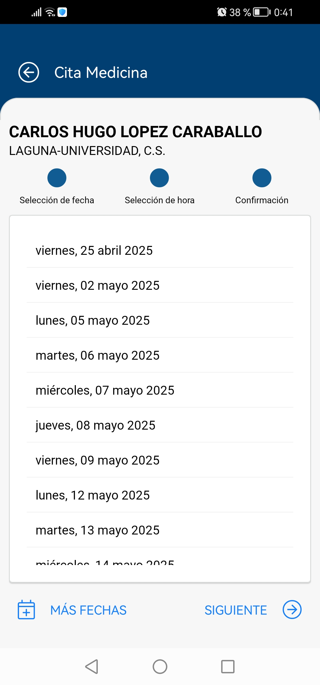

<p align="center">
  
</p>

<h1 align="center">namasteLoad — NAMASTE</h1>

**namasteLoad** contains the code used to load, extract, and process screenshots that are used to build  
the **NAMASTE** database (*Next Available Medical Appointment Survey for Tracking and Effectiveness*).  

NAMASTE focuses on analyzing medical appointment availability within **primary healthcare services of the Canary
Islands Health Service (SCS, Servicio Canario de la Salud)**. This work forms part of the project *Enhancing
Primary Care Efficiency by Recommending Telephone Consultations*, with NAMASTE representing the **first statistical
component driving the project’s data analysis**.

NAMASTE is dedicated to the **collection, storage, and analysis of data** related to *next available
medical appointments* in primary healthcare across the Canary Islands. The main source data are gathered through
the Canary Islands Health Service (SCS) application **_miCita Previa_**.

## ⚙️ How to Implement `namasteLoad`

Once you have cloned and configured the repository, you can use a **Jupyter Notebook**, **PyCharm**, or your preferred Python IDE to work with the code.

### 🩺 Input Data: Screenshots

To build the database, you need to have available screenshots from the miCita Previa application,
which should follow the structure shown below:

<p align="center">
  
  <br>
  <em>Example screenshot of <strong>miCita Previa</strong>.</em>
</p>

### 🧠 Project Structure


```
  namasteLoad/
  │
  ├── main.py                # Main script to execute data loading
  ├── extractors.py          # Functions to extract information from screenshots
  ├── classes_models.py      # Data classes and models
  ├── utils.py               # Utility functions
  ├── imgs/                  # Example of ab input image (see previous subsection)
  └── README.md
```

### 🧩 Requirements
Make sure you have Python 3.9+ installed and the required dependencies (see [`requirements.txt`](requirements.txt)):

```bash
pip install -r requirements.txt
```


## 🛡️ Data and Privacy Notice

This repository does include a few real data from the SCS system.
Only example images are provided for demonstration purposes.
Access to the original NAMASTE database is restricted and subject to ethical and legal authorization.

## 👥 Authors and Acknowledgments

Developed within the NAMASTE project (Next Available Medical Appointment Survey for Tracking and Effectiveness). 

© 2025 — López-Caraballo, C. et al.
