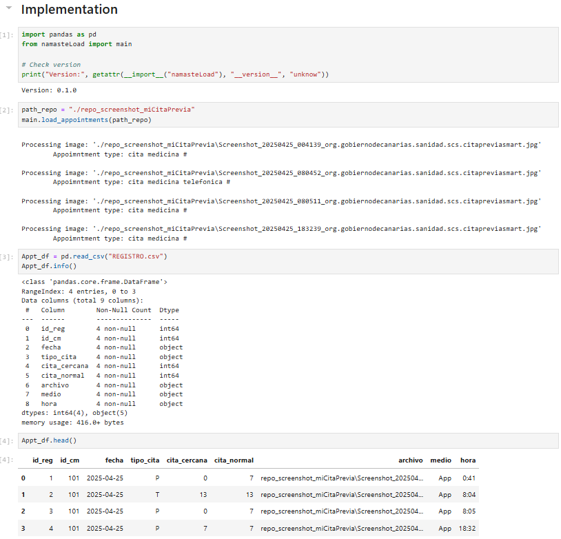

<p align="center">
  
</p>

<h1 align="center">namasteLoad — NAMASTE</h1>

<p align="center">
  <a href="https://github.com/lopezcaraballoch/namasteLoad/actions/workflows/ci.yml">
    
  </a>
</p

**namasteLoad** contains the code used to load, extract, and process screenshots that are used to build  
the **NAMASTE** database (*Next Available Medical Appointment Survey for Tracking and Effectiveness*).  

NAMASTE focuses on analyzing medical appointment availability within **primary healthcare services of the Canary
Islands Health Service (SCS, Servicio Canario de la Salud)**. This work forms part of the project *Enhancing
Primary Care Efficiency by Recommending Telephone Consultations*, with NAMASTE representing the **first statistical
component driving the project’s data analysis**.

NAMASTE is dedicated to the **collection, storage, and analysis of data** related to *next available
medical appointments* in primary healthcare across the Canary Islands. The main source data are gathered through
the Canary Islands Health Service (SCS) application **_miCita Previa_**.

## ⚙️ How to use `namasteLoad`

Once you have cloned and configured the repository, you can use a **Jupyter Notebook**, **PyCharm**, or your preferred Python IDE to work with the code.

### 🩺 Input Data: Screenshots

To build the database, you need to have available screenshots from the *miCita Previa* application,
which should follow the structure shown below::

<p align="center">
  
  <br>
  <em>Example screenshot of <strong>miCita Previa</strong>.</em>
</p>

### 🧠 Project Structure


```
  namasteLoad/
  │
  ├── main.py                # Main script to execute data loading
  ├── extractors.py          # Functions to extract information from screenshots
  ├── classes_models.py      # Data classes and models
  ├── utils.py               # Utility functions
  ├── imgs/                  # Example of an input screenshot image (see previous subsect.)
  ├── examples/              # Demo (includes four real screenshot images)
  │   └── demo_namasteLoad_miCitaPrevia.ipynb
  ├── .github/               # GitHub configuration
  │   └── workflows/ci.yml   # Continuous Integration workflow (Tesseract + smoke test)
  └── README.md
```

### 🧩 Requirements
Make sure you have Python 3.9+ installed and the required dependencies (see [`requirements.txt`](requirements.txt)):

```bash
pip install -r requirements.txt
```

## 🧪 Example of Implementation

A minimal, reproducible demonstration of the module can be found in _examples/demo_namasteLoad_miCitaPrevia.ipynb_ (also in [](https://colab.research.google.com/github/lopezcaraballoch/namasteLoad/blob/develop/examples/demo_namasteLoad.ipynb) ).


This Jupyter Notebook illustrates the complete workflow: from reading screenshot images
to extracting text via OCR, identifying medical centers, and exporting the resulting database
(CITAS.csv, REGISTRO.csv, and CENTROMEDICO.csv). REGISTRO.csv is the main table.

This show the result of running the example locally:

<p align="center">
  
  <br>
  <em>Running <strong>namasteLoad</strong> in a Jupyter Notebook with sample screenshots. _REGISTRO:cvs_ is the main table in NAMASTE database.</em>
</p>


## 🛡️ Data and Privacy Notice

This repository does include a few real data from the SCS system.
Only example images are provided for demonstration purposes.
Access to the original NAMASTE database is restricted and subject to ethical and legal authorization.

## 👥 Authors and Acknowledgments

NAMASTE is developed within the *Enhancing Primary Care Efficiency by Recommending Telephone Consultations* project. 

© 2025 — López-Caraballo, C. H. et al.
